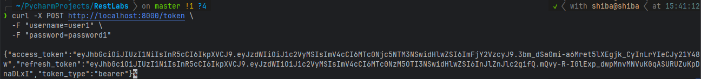
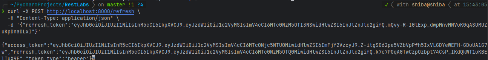
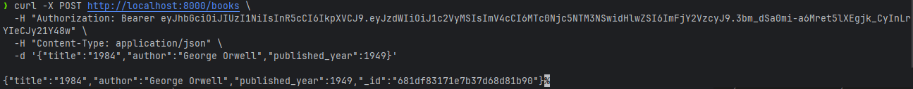

````markdown
# Lab 7: Library API (FastAPI + MongoDB + JWT Auth)

## Опис
Проста асинхронна REST-API для сутності **Book** з полями:
- `id`
- `title`
- `author`
- `published_year`

Підключається до MongoDB через Motor, серіалізація ObjectId за допомогою pydantic-mongo.  
Усі `/books` ендпоінти захищені JWT-автентифікацією з Access та Refresh токенами.

---

## Залежності

```txt
fastapi>=0.85.0
uvicorn[standard]>=0.18.0
motor>=3.1.1
pydantic-mongo>=0.1.0
python-jose[cryptography]>=3.3.0
passlib[bcrypt]>=1.7.4
python-multipart>=0.0.5
````

---

## Запуск в Docker

1. Перейдіть у папку:

   ```bash
   cd lab_7
   ```

2. Побудуйте та запустіть контейнери:

   ```bash
   docker compose up --build
   ```

   * **mongo** (порт 27017)
   * **api** (порт 8000)

3. REST API доступне за адресою `http://localhost:8000`

---

## Authentication

### Отримати Access & Refresh токени

```bash
curl -X POST http://localhost:8000/token \
  -F "username=user1" \
  -F "password=password1"
```

**Відповідь**

```json
{
  "access_token": "<JWT_ACCESS>",
  "refresh_token": "<JWT_REFRESH>",
  "token_type": "bearer"
}
```

### Обміняти Refresh на новий Access

```bash
curl -X POST http://localhost:8000/refresh \
  -H "Content-Type: application/json" \
  -d '{"refresh_token":"<JWT_REFRESH>"}'
```

**Відповідь**

```json
{
  "access_token": "<NEW_JWT_ACCESS>",
  "refresh_token": "<NEW_JWT_REFRESH>",
  "token_type": "bearer"
}
```

---

## CRUD для /books (захищені)

Усі запити до `/books` потребують заголовка:

```
Authorization: Bearer <JWT_ACCESS>
```

### Додати книгу

```bash
curl -X POST http://localhost:8000/books \
  -H "Authorization: Bearer <JWT_ACCESS>" \
  -H "Content-Type: application/json" \
  -d '{"title":"1984","author":"George Orwell","published_year":1949}'
```

### Отримати всі книги

```bash
curl http://localhost:8000/books \
  -H "Authorization: Bearer <JWT_ACCESS>"
```

### Отримати книгу за ID

```bash
curl http://localhost:8000/books/<book_id> \
  -H "Authorization: Bearer <JWT_ACCESS>"
```

### Видалити книгу

```bash
curl -X DELETE http://localhost:8000/books/<book_id> \
  -H "Authorization: Bearer <JWT_ACCESS>" -v
```

---

## Зупинка

```bash
docker compose down
```